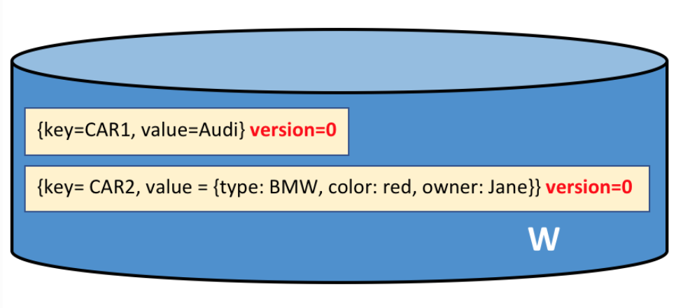

[ ] namespace

A ledger stores both the current value of the attributes of the objects, and the history of transactions that resulted in these current values.

In Hyperledger Fabric, a ledger consists of two distinct, though related, parts – a world state and a blockchain.

  

The world state is implemented as a database.

Applications are **insulated** from the details of consensus mechanism by the Hyperledger Fabric SDK; they merely invoke a smart contract, and are notified when the transaction has been included in the blockchain (whether valid or invalid).

A state has an version number. The version number is for internal use by Hyperledger Fabric, and is incremented (starts at 0) every time the state changes. The version is checked whenever the state is updated to make sure the current states matches the version at the time of endorsement. This ensures that the world state is changing as expected; that there has not been a **concurrent update**.

The world state is automatically generated when a peer is created. Moreover, if a peer fails abnormally, the world state can be regenerated on peer restart, before transactions are accepted.

The blockchain is always implemented as a **file**. This is a sensible design choice as the blockchain data structure is heavily biased towards a very small set of simple operations. **Appending to the end** of the blockchain is the primary operation, and query is currently a relatively infrequent operation.

The first block in the blockchain is called the *genesis block*. It’s the starting point for the ledger, though it **does not contain any user transactions**. Instead, it contains a **configuration transaction** containing the initial state of the network channel.

Block Header  
1. Block number: An integer starting at 0 (the genesis block), and increased by 1 for every new block appended to the blockchain.
2. Current Block Hash: The hash of all the transactions contained in the current block.
3. Previous Block Hash: A copy of the hash from the previous block in the blockchain.

Block Data  
This section contains a list of transactions arranged in order. It is written when the block is created by the ordering service.  

Block Metadata  
This section contains the time when the block was written, as well as the certificate, public key and signature of the block writer.  
Subsequently, the **block committer also adds a valid/invalid indicator for every transaction**, though this information is **not included in the hash**, as that is created when the block is created.

Transaction details  
Header: This section captures some essential metadata about the transaction – for example, the name of the relevant chaincode, and its version.  
Signature: This section contains a cryptographic signature, created by the **client application**. This field is used to check that the transaction details have not been tampered with, as it requires the application’s private key to generate it.  
Proposal: This field encodes the input parameters supplied by an application to the smart contract which creates the proposed ledger update.  
Response: This section captures the before and after values of the world state, as a Read Write set (RW-set). It’s the output of a smart contract.  
Endorsements: This is a list of signed transaction responses from each required organization sufficient to satisfy the endorsement policy. You’ll notice that, whereas only one transaction response is included in the transaction, there are multiple endorsements. [ ] That’s because each endorsement effectively encodes its organization’s particular transaction response – meaning that there’s no need to include any transaction response that doesn’t match sufficient endorsements as it will be rejected as invalid, and not update the world state.  

Options for the world state database currently include LevelDB and CouchDB.  
LevelDB is the default and is particularly appropriate when ledger states are simple key-value pairs. A LevelDB database is closely co-located with a network node – it is embedded within the same operating system process.  
CouchDB is a particularly appropriate choice when ledger states are structured as JSON documents because CouchDB supports the rich queries and update of richer data types often found in business transactions. Implementation-wise, CouchDB runs in a separate operating system process, but there is still a 1:1 relation between a peer node and a CouchDB instance.  
The world state database **could be** a relational data store, or a graph store, or a temporal database. This provides great flexibility in the types of ledger states that can be efficiently accessed, allowing Hyperledger Fabric to address many different types of problems.

**Each chaincode has its own world state** that is separate from all other chaincodes. World states are in a namespace so that only smart contracts within the same chaincode can access a given namespace.

A blockchain is not namespaced. It contains transactions from many different smart contract namespaces.

In Hyperledger Fabric, each channel has a completely separate ledger. This means a completely separate blockchain, and completely separate world states, including namespaces.  
It is possible for applications and smart contracts to communicate between channels so that ledger information can be accessed between them.